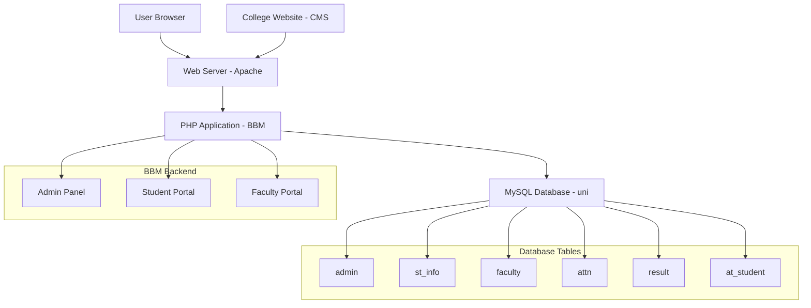
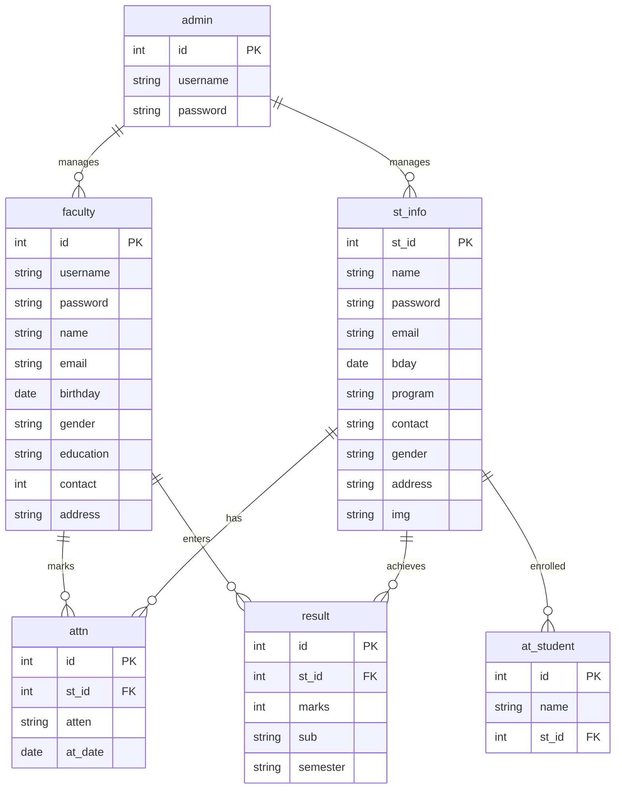
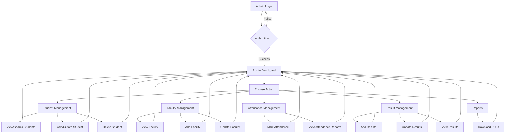
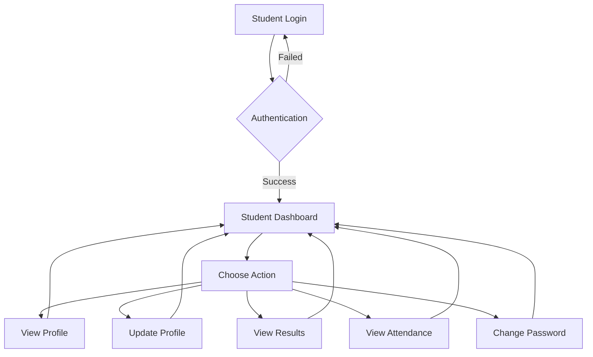
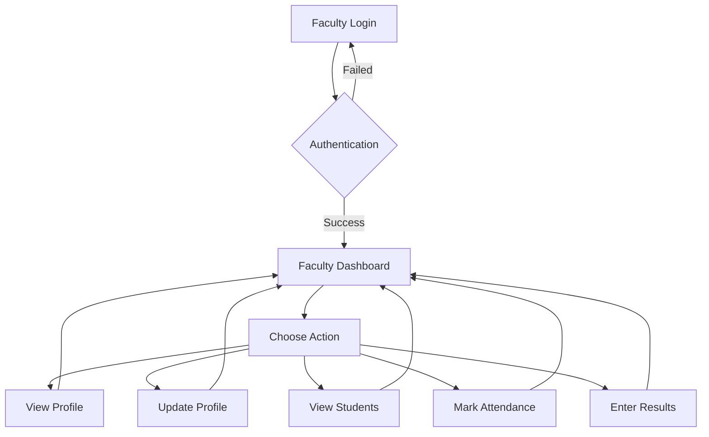

# University Management System (BBM)

## Project Overview

This is a comprehensive web-based University Management System developed for Parala Maharaja Engineering College, Berhampur, Odisha. The system facilitates efficient management of university operations including student enrollment, faculty management, attendance tracking, result management, and administrative oversight.

## Screenshots

### College Website Homepage


_The public-facing college website with navigation to administrative login._

### Admin Login Page


_Secure login interface for administrators._

### Admin Dashboard


_Main dashboard showing available management options for students, faculty, attendance, and results._

### Student Management


_View and manage all registered students with search and edit capabilities._

### Faculty Management


_Comprehensive faculty information and management interface._

### Attendance Management


_Mark and track student attendance with date-wise records._

### Result Management


_Add and update student academic results._

### Student Portal


_Student dashboard for viewing personal information, results, and attendance._

_Note: Screenshots should be added to a `screenshots/` folder in the repository root for proper display._

## Features

### Admin Panel

- **Student Management**: View all students, search students, update student profiles, delete students
- **Faculty Management**: View all faculty, add new faculty, update faculty profiles
- **Attendance Management**: Mark and view student attendance, class-wise attendance reports
- **Result Management**: Add, update, and view student results, CGPA calculation
- **Reports**: Download student and faculty lists in PDF format

### Student Portal

- **Profile Management**: View and update personal information
- **Result Viewing**: Access academic results and CGPA
- **Attendance Tracking**: View personal attendance records
- **Password Management**: Change account password

### Faculty Portal

- **Profile Management**: View and update personal information
- **Student Oversight**: Access student information and results
- **Attendance Management**: Mark attendance for students

### College Website (CMS)

- **Public Website**: College information, notices, and administrative access link
- **Responsive Design**: Modern, mobile-friendly interface

## Technologies Used

- **Backend**: PHP 5.6.3 / 7.4.12
- **Database**: MySQL
- **Frontend**: HTML5, CSS3, JavaScript
- **Libraries**: jQuery 1.12.0, Modernizr 2.8.3, Font Awesome
- **PDF Generation**: FPDF
- **File Upload**: Blueimp jQuery File Upload
- **Styling**: Normalize.css, Custom CSS

## Setup Instructions

### Prerequisites

- XAMPP (includes Apache, MySQL, PHP)
- Web browser

### XAMPP Installation

1. Download XAMPP from the official website: https://www.apachefriends.org/
2. Install XAMPP on your system
3. Launch the XAMPP Control Panel
4. Start the Apache and MySQL modules

### Database Setup

1. Open your web browser and navigate to http://localhost/phpmyadmin
2. Create a new database named `uni`
3. Select the `uni` database
4. Click on the "Import" tab
5. Choose the file `DATABASE FILE/uni.sql` from the project directory
6. Click "Go" to import the database schema and data

### PHP Setup and Project Deployment

1. Locate your XAMPP installation directory (usually `C:\xampp` on Windows)
2. Copy the entire project folder to `htdocs` directory (e.g., `C:\xampp\htdocs\BBM`)
3. Ensure PHP is configured correctly in XAMPP (default settings should work)
4. Open your web browser and navigate to http://localhost/BBM
5. The application should now be accessible

### Default Login Credentials

- **Admin**: Username and password can be found in `BBM/01 LOGIN DETAILS & PROJECT INFO.txt`
- **Student/Faculty**: Registration required or check the database for existing accounts

## System Architecture



### Architecture Overview

- **Frontend Layer**: HTML/CSS/JS interfaces for different user roles
- **Application Layer**: PHP scripts handling business logic and database interactions
- **Data Layer**: MySQL database storing all system data
- **External Interfaces**: File upload system and PDF generation

## Database ER Diagram



### Database Relationships

- **Admin** manages all students and faculty
- **Faculty** can mark attendance and enter results for students
- **Students** have attendance records and academic results
- **at_student** table links students for attendance management

## User Flow Diagrams

### Admin Workflow



### Student Workflow



### Faculty Workflow



## Database Schema

The system uses a MySQL database named `uni` with the following tables:

- `admin`: Administrative user accounts
- `st_info`: Student information and profiles
- `faculty`: Faculty member details
- `attn`: Attendance records
- `at_student`: Students enrolled for attendance
- `result`: Academic results and marks

## Installation and Setup

### Prerequisites

- PHP 5.6.3 or 7.4.12
- MySQL Server
- Web server (Apache recommended)
- Local development environment like XAMPP, WAMP, or MAMP

### Steps

1. **Clone the Repository**

   ```bash
   git clone https://github.com/your-username/university-management-system.git
   cd university-management-system
   ```

2. **Database Setup**
   - Create a new MySQL database named `uni`
   - Import the provided `uni.sql` file from the `DATABASE FILE` folder

   ```sql
   mysql -u root -p uni < BBM/DATABASE FILE/uni.sql
   ```

3. **Web Server Configuration**
   - Place the project files in your web server's document root
   - For XAMPP: Copy to `htdocs` folder
   - Ensure the `img` folder has write permissions for file uploads

4. **Database Connection**
   - The system is configured to connect to MySQL on localhost with:
     - Host: localhost
     - Username: root
     - Password: (empty)
     - Database: uni
   - Modify `BBM/php/config.php` if your database credentials differ

5. **Access the Application**
   - College Website: `http://localhost/CMS/index.html`
   - Admin Login: `http://localhost/BBM/index.php`
   - Student Login: `http://localhost/BBM/st_login.php`
   - Faculty Login: `http://localhost/BBM/facultylogin.php`

## Default Login Credentials

### Admin

- Username: `admin`
- Password: `123`

### Faculty

- Username: `robinson`
- Password: `123`

### Students

- Various student accounts are pre-populated in the database
- Example: Student ID `12103072`, Password as per database

## Project Structure

```
/
├── BBM/                          # Backend PHP Application
│   ├── index.php                 # Admin Login
│   ├── admin.php                 # Admin Dashboard
│   ├── st_login.php              # Student Login
│   ├── facultylogin.php          # Faculty Login
│   ├── php/                      # PHP Classes and Config
│   │   ├── config.php            # Database Configuration
│   │   ├── functions.php         # Core Functions Class
│   │   └── ...
│   ├── css/                      # Stylesheets
│   ├── js/                       # JavaScript Files
│   ├── img/                      # Uploaded Images
│   ├── plugins/                  # Third-party Plugins
│   └── DATABASE FILE/            # Database Schema
├── CMS/                          # College Website Frontend
│   ├── index.html                # Home Page
│   ├── login.html                # Login Page
│   ├── admin.html                # Admin Interface
│   ├── faculty.html              # Faculty Interface
│   ├── assets/                   # Images and Assets
│   ├── css/                      # Stylesheets
│   └── js/                       # JavaScript Files
└── README.md                     # This File
```

## Key Functionalities

### Student Management

- Registration and profile updates
- Academic result tracking
- Attendance monitoring
- CGPA calculation

### Faculty Management

- Profile management
- Student result entry
- Attendance marking

### Administrative Features

- Comprehensive student and faculty databases
- Bulk operations and reporting
- PDF generation for records
- Secure login system

## Code Examples

### Database Connection (config.php)

```php
<?php
class databaseConnection{
    public function __construct(){
        global $conn;
        $conn = new mysqli("localhost", "root", "" , "uni");
        //check error
        if(!$conn){
            die("Database cannot established connection properly: " . $conn->connect_error());
        }
    }
}
?>
```

### User Authentication (functions.php)

```php
public function admin_userlogin($username, $password){
    global $conn;
    $sql = "SELECT * FROM admin WHERE username='$username' and password='$password'";
    $result = $conn->query($sql);
    $count = $result->num_rows;
    if($count == 1){
        session_start();
        $_SESSION['admin_login'] = true;
        $_SESSION['admin_username'] = $username;
        return true;
    }else{
        return false;
    }
}
```

### Student Registration

```php
public function st_registration($st_id,$st_name,$st_pass,$st_email,$bday,$st_dept,$st_contact,$st_gender,$st_add){
    global $conn;
    $query = $conn->query("select st_id from st_info where st_id='$st_id' or email ='$st_email' ");
    $num = $query->num_rows;
    $in_sql = "INSERT INTO st_info (st_id,name,password,email,bday,program,contact,gender,address) VALUES ('$st_id','$st_name','$st_pass','$st_email','$bday','$st_dept','$st_contact','$st_gender','$st_add') ";
    if($num == 0){
        $conn->query($in_sql);
        return true;
    }else{
        return false;
    }
}
```

### Result Management

```php
public function add_result($st_id, $marks, $subject, $semester){
    global $conn;
    $sql = "INSERT INTO result (st_id, marks, sub, semester) VALUES ('$st_id', '$marks', '$subject', '$semester')";
    if($conn->query($sql)){
        return true;
    }else{
        return false;
    }
}
```

## Configuration and Deployment

### Environment Variables

The application uses the following configuration:

- **Database Host**: localhost
- **Database Name**: uni
- **Database User**: root
- **Database Password**: (empty by default)

### File Permissions

Ensure the following directories have proper write permissions:

- `BBM/img/student/` - For student profile images
- `BBM/img/faculty/` - For faculty profile images
- `BBM/DATABASE FILE/` - For database backups

### Web Server Configuration

For Apache, ensure `mod_rewrite` is enabled if using URL rewriting.

### PHP Configuration

Required PHP extensions:

- mysqli
- mbstring
- fileinfo
- gd (for image processing)

## Security Considerations

### Current Security Measures

- MD5 password hashing (recommended to upgrade to bcrypt)
- Session-based authentication
- Input validation on forms
- Role-based access control

### Recommended Security Enhancements

- Implement password strength requirements
- Add CSRF protection
- Use prepared statements for all database queries
- Implement rate limiting for login attempts
- Add SSL/TLS encryption
- Regular security audits

## Performance Optimization

### Database Optimization

- Add indexes on frequently queried columns
- Use prepared statements to prevent SQL injection
- Implement database connection pooling

### Code Optimization

- Minify CSS and JavaScript files
- Enable gzip compression
- Use caching for static assets
- Optimize images before upload

## Troubleshooting

### Common Issues

1. **Database Connection Failed**
   - Check MySQL server is running
   - Verify database credentials in `config.php`
   - Ensure database `uni` exists

2. **File Upload Not Working**
   - Check write permissions on `img/` folder
   - Verify PHP upload settings in `php.ini`
   - Check file size limits

3. **Session Issues**
   - Ensure `session.save_path` is writable
   - Check for conflicting session configurations

4. **PDF Generation Failed**
   - Verify FPDF library is properly included
   - Check write permissions for PDF output

### Debug Mode

To enable debug mode, add the following to PHP files:

```php
ini_set('display_errors', 1);
error_reporting(E_ALL);
```

## Testing

### Manual Testing Checklist

- [ ] Admin login functionality
- [ ] Student registration and login
- [ ] Faculty registration and login
- [ ] Student profile updates
- [ ] Attendance marking and viewing
- [ ] Result entry and viewing
- [ ] PDF report generation
- [ ] File upload functionality
- [ ] Password change functionality

### Sample Test Data

Use the pre-populated data in `uni.sql` for testing:

- Admin: admin / 123
- Faculty: robinson / 123
- Students: Multiple accounts available

## API Reference

The system doesn't expose REST APIs but uses internal PHP functions. Key methods in `functions.php`:

- `admin_userlogin($username, $password)` - Admin authentication
- `st_userlogin($st_id, $password)` - Student authentication
- `fct_userlogin($username, $password)` - Faculty authentication
- `st_registration(...)` - Student registration
- `fct_registration(...)` - Faculty registration
- `add_result(...)` - Add student results
- `mark_attendance(...)` - Mark student attendance

## Security Features

- MD5 password hashing
- Session-based authentication
- Role-based access control
- Input validation and sanitization

## Development Notes

- Developed by: Abul Kalam
- Original Development Date: Around 2021
- Recommended PHP Versions: 5.6.3, 7.4.12
- Database: MySQL with phpMyAdmin export

## Future Enhancements

- Upgrade to more secure password hashing (bcrypt)
- Implement modern PHP frameworks
- Add API endpoints for mobile app integration
- Enhance UI/UX with modern frameworks
- Add email notifications
- Implement backup and restore features

## Contributing

1. Fork the repository
2. Create a feature branch
3. Make your changes
4. Test thoroughly
5. Submit a pull request

## License

This project is developed for educational purposes. Please check with the original developer for licensing information.

## Support

For support or questions, please refer to the original developer: Abul Kalam
Visit: codeastro.com for more projects</content>
<parameter name="filePath">e:\se7\Complete code\README.md
# University-Management-System

